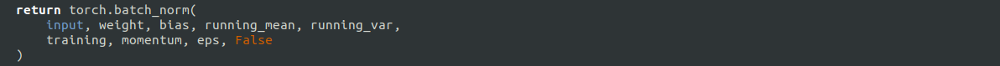

# Installation

Everything was carried out on Ubuntu 18.04, with Anconda (or Miniconda). You'll need a Nvidia GPU with CUDA 10.0 or 11.0 (tested on 10.0). The use of a GPU is highly recommended, especially for training. If you still want to use your CPU, please refer to [INSTALLATION_CPU.md](INSTLATTION_CPU.md)

0. Prerequisite installations
   ~~~
   sudo apt install g++ cmake make git 
   ~~~
1. Create a new conda environment:
   ~~~
   conda create --name CenterNet python=3.6
   ~~~

   And activate the env:
   ~~~
   conda activate CenterNet
   ~~~
2. Install Pytorch 1.2.0:
   ~~~
   conda install pytorch=1.2.0 torchvision -c pytorch
   ~~~
   Open `miniconda3/envs/CenterNet/lib/python3.6/sites-packages/torch/nn/functional.py` or `Anaconda3/envs/CenterNet/lib/python3.6/sites-packages/torch/nn/functional.py` (if you are using Anaconda).
   Find the line with `torch.batch_norm` and replace the `torch.backends.cudnn.enabled` with `False`.
   

3. Install Cython:
   ~~~
   conda install -c anaconda cython
   ~~~
   
4. Install COCOAPI:
   ~~~
   # COCOAPI=/path/to/clone/cocoapi
   git clone https://github.com/cocodataset/cocoapi.git $COCOAPI
   cd $COCOAPI/PythonAPI
   make
   python setup.py install --user
   ~~~
5. Install CenterNet-instrument:
   ~~~
   CenterNet_ROOT=/path/to/clone/CenterNet
   git clone https://github.com/dvegas/CenterNet-instrument $CenterNet_ROOT
   ~~~
6. Install requirements:
   ~~~
   pip install -r requirements.txt
   pip3 install opencv-python==3.4.13.47
   ~~~
7. Compile deformable convolutional (from [DCNv2](https://github.com/CharlesShang/DCNv2)).
   ~~~
   cd $CenterNet_ROOT/src/lib/models/networks/DCNv2
   ./make.sh
   ~~~
8. Download pretrained models for detection move them to `$CenterNet_ROOT/models/`. 
