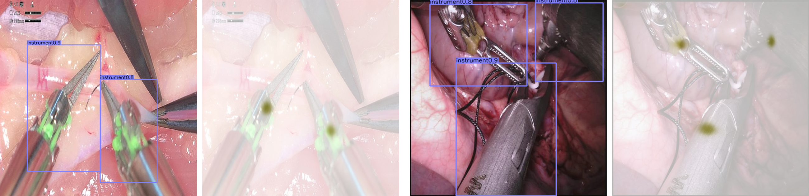
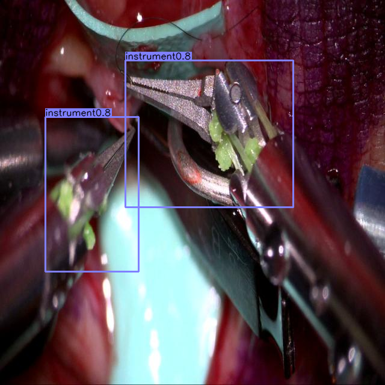
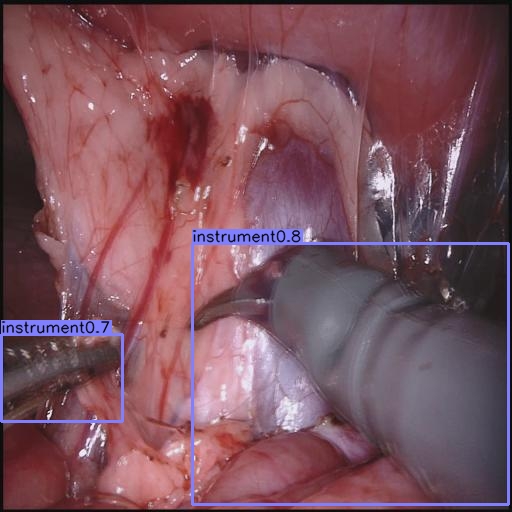
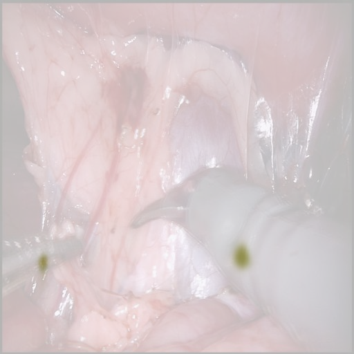

# Surgical instrument center detected using Centernet

Detection of instrument centers using CenterNet: 

## Disclaimer
This project is based on [CenterNet](https://github.com/xingyizhou/CenterNet) , created by [xingyizhou](https://github.com/xingyizhou). My work consists of modifications and additions to this repository, but it remains fundamentally based on the original author's work.

All credit for the original work and original contributions must be attributed to the original author. I claim no authority over the original repository, its goals, or its future versions.

If you are interested in the original repository or wish to contribute to it, please refer to the link above.

## Abstract 

[CenterNet](https://github.com/xingyizhou/CenterNet) is a one-step object detector that detects each object, including the center of its bounding boxes. To detect key points on surgical instruments for tracking purposes, I used CenterNet and trained it on my own data. Over 1,000 different instrument images were annotated on roboflow with bouding boxes, for a dataset comprising 2,600 training images, 250 validation images and 160 test images using various data augmentation methods. Training was carried out with a batch size of 8 and 140 epochs to obtain 3 [models](readme/MODEL.md) for instrument center detections. 

The dataset with images and annotations I used for training and testing is available for download [here](https://drive.google.com/file/d/1rfeKxLpjwuKfrhos9av9BJ5fWVJuxxtC/view?usp=drive_link).

All models and details are available in [model](readme/MODEL.md).

## Installation
All the installation instructions can be found in [INSTALLATION.md](readme/INSTALLATION.md) 

## Use CenterNet-instrument

Images and videos are supported for demo. 

First, download the [models](readme/MODEL.md) and put them in `CenterNet_ROOT/models/` (model_1 by default)

For object detection on images/ video, go to `CenterNet_ROOT/src/` and run :

~~~
python demo.py ctdet --demo /path/to/image/or/folder/or/video --load_model ../models/model_1.pth
~~~

You can find example images in `CenterNet_ROOT/images/`

Example:

~~~
python demo.py ctdet --demo ../images/instrument1.jpg --load_model ../models/model_1.pth
~~~

If set up correctly, the output with the above command should look like this :

   

Add --debug 2 to the previous command to visualize the heatmap output.

~~~
python demo.py ctdet --demo ../images/instrument2.jpg --load_model ../models/model_1.pth --debug 2
~~~

Output should look like this :

   

If you want to have the coordinates (x,y) of the instruments centers add --debug 5 and the coordinates will be written in `CenterNet_ROOT/src/coordinates.txt`

~~~
python demo.py ctdet --demo ../images/instrument2.jpg --load_model ../models/model_1.pth --debug 5

~~~
## Training on your own dataset
If you want to use your own dataset to train CenterNet you can. All the details are in [TRAIN.md](readme/TRAIN.md)

## Testing on your own dataset

Once you've completed training, you can test your model, all the details are in [TEST.md](readme/TEST.md)