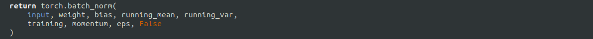

# Installation on CPU

0. Prerequisite installations
   ~~~
   sudo apt install g++ cmake make git 
   ~~~
1. Create a new conda environment:
   ~~~
   conda create --name CenterNet python=3.6
   ~~~

   And activate the env:
   ~~~
   conda activate CenterNet
   ~~~
2. Install Pytorch 1.2.0:
   ~~~
   conda install pytorch=1.2.0 torchvision -c pytorch
   ~~~
   Open `miniconda3/envs/CenterNet/lib/python3.6/sites-packages/torch/nn/functional.py` or `Anaconda3/envs/CenterNet/lib/python3.6/sites-packages/torch/nn/functional.py` (if you are using Anaconda).
   Find the line with `torch.batch_norm` and replace the `torch.backends.cudnn.enabled` with `False`.
   

3. Install Cython:
   ~~~
   conda install -c anaconda cython
   ~~~
   
4. Install COCOAPI:
   ~~~
   # COCOAPI=/path/to/clone/cocoapi
   git clone https://github.com/cocodataset/cocoapi.git $COCOAPI
   cd $COCOAPI/PythonAPI
   make
   python setup.py install --user
   ~~~
5. Install CenterNetfor instrument:
   ~~~
   CenterNet_ROOT=/path/to/clone/CenterNet
   git clone https://github.com/dvegas7/Surgical-instrument-center-detected-using-Centernet.git$CenterNet_ROOT
   ~~~
6. Install requirements:
   ~~~
   pip install -r requirements.txt
   pip3 install opencv-python==3.4.13.47
   ~~~
7. Remove everything related to CUDA:
   
   Open `$CenterNet_ROOT/src/lib/detectors`

   In `base_detector.py`replace:
   ~~~
   def __init__(self, opt):
    if opt.gpus[0] >= 0:
      opt.device = torch.device('cuda')
    else:
      opt.device = torch.device('cpu')
   ~~~
   By
   ~~~
     def __init__(self, opt):
        opt.device = torch.device('cpu')
   ~~~
   Delete all the lines about CUDA Synchronisation in`base_detector.py`, `ctdet.py`, `ddd.py`, `detector_factory.py`, `exdet.py`and `multi_pose.py`.
   ~~~
   torch.cuda.synchronize()
   ~~~
   I may have forgotten some files, but in any case you need to delete these lines from the other files to be able to run CenterNet with the CPU.
9. Compile deformable convolutional (from [DCNv2](https://github.com/CharlesShang/DCNv2)).
   ~~~
   cd $CenterNet_ROOT/src/lib/models/networks/DCNv2
   ./make.sh
   ~~~
10. Download pretrained [models](MODEL.md) for detection move them to `$CenterNet_ROOT/models/`. 
