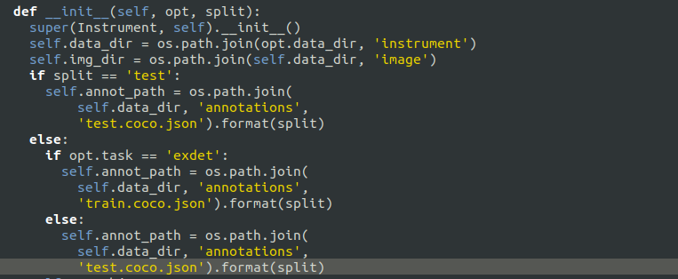
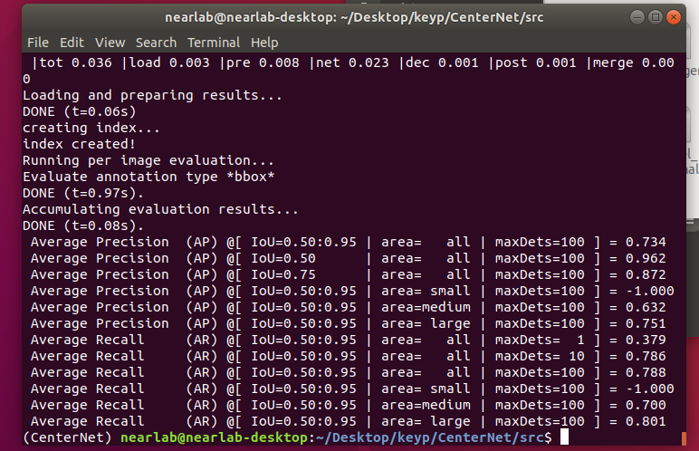
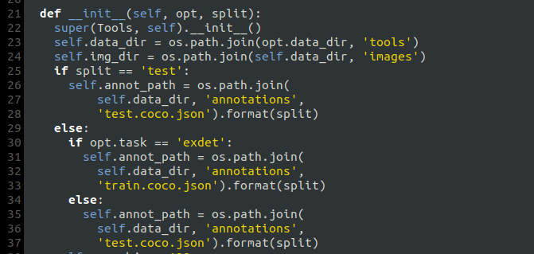
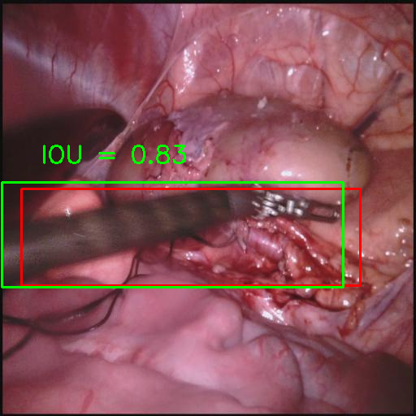
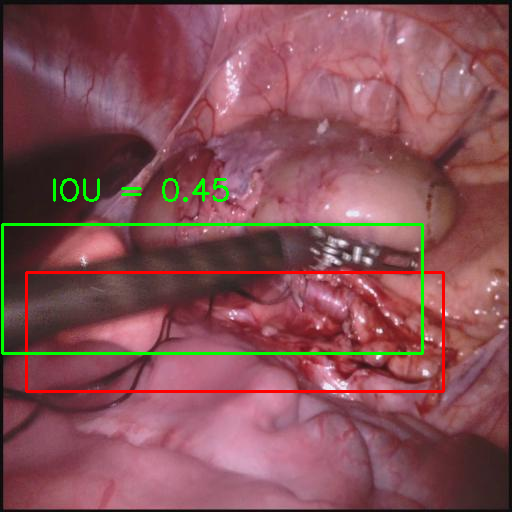
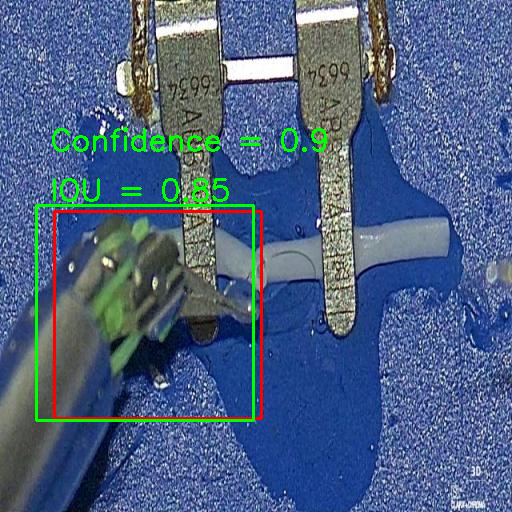
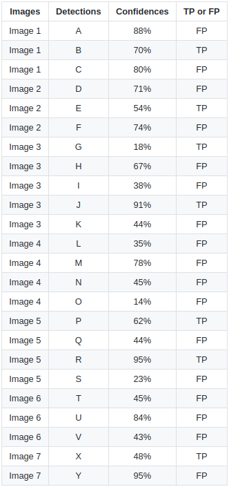
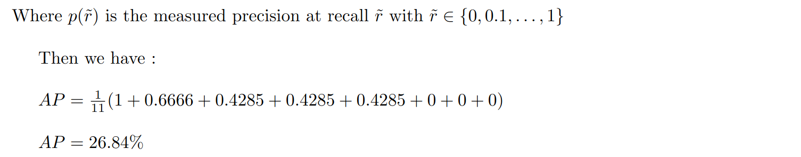
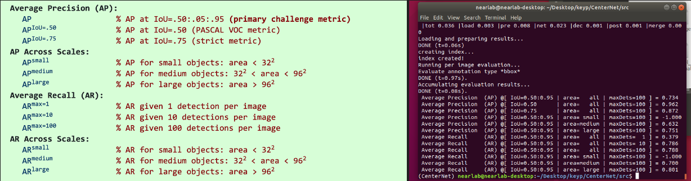

# Testing your model

## For a single instrument class 

1. In `CenterNet_ROOT/src/lib/datasets/dataset` modify `instrument.py` like this `if split == 'test' : ...` : 

    
   

    The function is to specify the label file as the test file test.coco.json created before.

2. Go to `CenterNet_ROOT/src` and run `test.py`

    ~~~
    python test.py --exp_id coco_dla --not_prefetch_test ctdet --load_model path/to/your/model
    ~~~

    For example :

    ~~~
    python test.py --exp_id coco_dla --not_prefetch_test ctdet --load_model /CenterNet_ROOT/exp/ctdet/coco_dla/model_best.pth
    ~~~

    If set up correctly, the output with the above command should look like this :

    
   

    To understand the test results and how they are calculated please refer to [Results](#results)

## For multiple classes 

1. In `CenterNet_ROOT/src/lib/datasets/dataset` modify the `.py` created before (in my case `tools.py`) like this `if split == 'test' : ...` : 

    
   

2. Go to `CenterNet_ROOT/src` and run `test.py`

    ~~~
    python test.py --exp_id coco_dla --not_prefetch_test ctdet --load_model path/to/your/model
    ~~~

    For example :

    ~~~
    python test.py --exp_id coco_dla --not_prefetch_test ctdet --load_model /CenterNet_ROOT/exp/ctdet/coco_dla/model_best.pth
    ~~~

    If set up correctly, the output with the above command should look like this :

    
   

    It also generates a `result.json`file in COCO format in `CenterNet_ROOT/exp/ctdet/coco_dla` which lists the score of each detection for each image in the test dataset, as well as the coordinates of the associated bounding boxes. 

    To understand the test results and how they are calculated please refer to [Results](#results)

## Results 

As you can see after running `test.py`. We obtain a series of average precision `AP` and average recall `AR` values. This is how the results are obtained :

If you want all the details of the calculation, check [Object-Detection-Metrics](https://github.com/rafaelpadilla/Object-Detection-Metrics) it's all explained there. I'll try to summarize the most important points to help understanding how these results are obtained. 

### Intersection over union (IOU)

It measures the overlap between the ground-truth bounding boxes (the hand-labeled bounding boxes) and the predicted bounding boxes by the model. It is the ratio between the Intersection and Union of the ground truth boxes with the predicted bounding boxes.

This images from [Object-Detection-Metrics](https://github.com/rafaelpadilla/Object-Detection-Metrics) illustrates  the `IOU` :

   

Another visual example from our dataset :

   

In green the hand-labelled bounding boxe and in red the predicted one. In practice, we try to get as close as possible to the value 1, but an `IOU>0.50` is already good. 

### Precision and Recall

Precision and Recall are fundamental metrics used to evaluate the performance of classification and detection systems, including object detection in computer vision. Before discussing precision and recall, it's important to understand some key terms:

- True Positive `TP` : The number of times the model correctly predicted the positive input sample. In this context each time an instrument has been detected and located in the image. 

- False Positive `FP` : These are incorrect positive predictions. In this context, a false positive happens when the model incorrectly detects an instrument that is not present in the image.

- True Negative `TN` : These are the correct negative predictions made by a system. Here, a true negative occurs when the system correctly identifies the absence of an instrumenet, i.e., when there is no object in the image, and the model correctly doesn't detect one.

- False Negative `FN` : The number of time the model incorrectly predicted the positive input as negative. In our case false negative occurs when the model fails to detect an instrument that is actually present in the image.

Note that here a detection made by the model is considered True Positive only if it satisfies the two conditions:

- The confidence score of the predicted bounding box should be greater than the confidence threshold (which is 0.6 here), signifying that we have found the object for which we were looking.

- The `IoU` between the predicted bounding box and the hand-labelled bounding box should be greater than the `IoU` threshold (which can take several different values ranging from 0.5 to 0.95).

   

Here's an example of a True positive, the `IOU` is above the treshold and the confidence level is higher than 0.6. 

Now, let's discuss about precision and recall:

1. Precision measures the accuracy of positive predictions made by a system. It's the ratio of true positive predictions to all positive predictions, showing how accurate the system's positive guesses are. The formula is :

$$ Precision = {TP \over TP + FP} $$

    

2. Recall answers whether your model guessed every time that it should be guessing. The higher the recall, the more positive samples are detected. It is the ratio of true positive predictions to the total number of actual positive cases. Recall is crucial when it's essential to capture all relevant instances. The formula is :

$$ Recall = {TP \over TP + FN} $$

### Precision-Recall Curve and Average Precision

From what we saw, we understand that a model with high precision and recall correctly identifies positive samples and captures a substantial portion of all positive samples. In contrast, a model with high precision but low recall accurately predicts positive samples but misses a significant number of them, leading to an increased count of false negatives.

With this in mind, the aim is to find the best score for precision and recall. 

The Precision-Recall curve is as crucial, if not more so, in evaluating the performance of an object detection model. A good object detector maintains high precision and recall even when we change the confidence threshold (the probability that a box contains an instrument). It means that as we find more instruments (recall increases), we shouldn't see a significant drop in precision.

We can also assess the performance of object detectors by calculating the area under the Precision-Recall curve `p`, known as `AUC` (Area Under the Curve). `AP` (Average Precision) is another helpful metric for comparing different detectors. `AP` is a number that tells us how well a detector performs. In practical terms, `AP` is the average precision calculated for all possible recall values ranging from 0 to 1. It helps us compare detectors more easily because `AP` provides a single numerical measure of performance.

$$ AP = \int_{0}^{1} p(r) dr $$

To fully understand the importance of Precision-Recall and `AP` we would use [rafaelpadilla](https://github.com/rafaelpadilla) repo [Object-Detection-Metrics](https://github.com/rafaelpadilla/Object-Detection-Metrics) which provides an excellent example. 

Considering this detection : 

   

There are 7 images with 15 ground truth objects represented by the green bounding boxes and 24 detected objects represented by the red bounding boxes. Each object is detected with a certain level of confidence and assigned a letter from A to Y. 

To make this clearer, we provide a table with the detection identifier letter and confidence level for each image. The last column tells you whether the detection is `FP` or `TP`, depending on the conditions mentioned above (here the `IOU` threshold is 0.3).

   

The Precision-Recall curve is created by calculating precision and recall values based on the accumulated True Positives `TP and False Positives (FP) detections. To do this, we start by arranging the detections in order of their confidence scores. Then, we compute precision and recall for each step as we accumulate detections with the formula above, as demonstrated in the table below. Note that for recall computation, the denominator term ("Acc TP + Acc FN" or "All ground truths") is constant at 15 since hand-labelled boxes are constant irrespective of detections:

   

Example : for the 6th line (image 1), Precision = TP/(TP+FP) = 2/(2+4) = 1/3 and Recall = TP/(TP+FN) = (2/15) = 0.133333

When we plot the Precision values with the Recall values we obtain the Precision-Recall curve as follow :

   

We now use the 11-point interpolation method in the context of evaluating and visualizing the performance of object detection models, the concept of "11 Points of Interpolation" plays a pivotal role. These 11 specific points along the Precision-Recall curve allow us to gain a deeper understanding of how our model performs at various levels of precision and recall, ranging from 0 to 1 with increments of 0.1. The other method consists of calculating the interpolation performed in all points but it will not be detailed here 

These interpolation points provide a detailed assessment of the model's performance at different recall levels, offering valuable insights for evaluation and optimization. By connecting these points, we can visualize the Precision-Recall curve and calculate metrics like Average Precision (AP) to summarize the model's overall quality.

The interpolated precision values are obtained by taking the maximum precision whose recall value is greater than its current recall value as follows:

   

We calculate the `AP` with the following formula :

$$ AP = \frac{1}{11}\sum_{\tilde{r} \in \{0, 0.1,  \ldots, 1\}} p(\tilde{r}) $$

   

### The COCO Evaluator

Now that we've understood how the average precision `AP` is calculated, we can take a look at the COCO evaluator used to evaluate the model in our case. It is widely used to evaluate object detection models. 

Let's have a look at the object detection COCO evaluation metric :

    

#### Average Precision (AP) :

We can see 3 lines for the average precision :

1. AP:

    Using just one `IoU` threshold to evaluate our detection model may not be ideal because it can introduce bias and be too forgiving. To address this, the COCO evaluator takes a more comprehensive approach. It calculates the Average Precision (AP) over a range of 10 `IoU` thresholds, starting at 0.5 and going up to 0.95, with small steps of 0.05 in between and makes the average.

    This method ensures that our evaluation isn't overly strict or lenient. It assesses how well the model's detected bounding boxes align with the actual objects at various levels of overlap. In essence, it gives us a well-rounded view of how accurately our model can locate objects in different scenarios.

2. AP[IOU=.50]:

    This metric focuses on a specific IoU threshold of 0.5 like we see above. It calculates the Average Precision when a predicted bounding box and a ground truth bounding box have at least a 50% overlap. This threshold is commonly used to assess object detection tasks and is a measure of how well objects are localized.

3. AP[IOU=.75]:

    AP[IOU=.75] is similar to AP[IOU=.50] but uses a stricter IoU threshold of 0.75. This metric evaluates object detection performance based on higher overlap requirements between predicted and ground truth bounding boxes. It measures the precision of highly accurate object localization.

Note that for each line of our results `maxDets` limits the number of detections our model can make for each image. For average precision we have `maxDets = 100`

#### AP Across Scales:

`AP` across three scales can be quite helpful. As written, this calculates the `AP` according to the size of the object to be detected. For example, if your task involves finding many small objects, you'd want to make sure you do well in detecting those. But in our case it's not very interesting as the size of the instruments is quite large in relation to the image, which explains the `-1.000` result we obtained for the small surfaces. Because we don't have small detection to do. 

#### Average Recall (AR) :

The computation of the mean Average Recall `AR` shares similarities with the mean Average Precision `AP`, but it focuses on a different aspect of model performance. Instead of analyzing precision vs recall, we analyze the recall behavior using different `IoU` thresholds. `AR` is the recall averaged over all `IOU` of 0.5 to 1.

and can be computed as two times the area under the recall-IoU curve:

$$ AR = 2\int_{0.5}^{1} recall(o) do $$

Here we have 3 lines where the `maxDets` takes the values `1`, `10`, `100` which limits the number of detections. 

Adjusting the value of `maxDets` when calculating Average Recall is an important decision to control the sensitivity of the metric to multiple detections of the same object. This relates to how multiple detections are handled in `AR` calculation and the impact it can have on the evaluation of the object detection algorithm's performance.

#### AR Across Scales :

Same as [AP across scales](#average-recall-ar) but with the Average Recall. 

### Note 

Here we've only talked about `AP` because we only have one class that we want to detect: instruments. If you have several classes, we're talking about Mean Average precision `mAP` and Mean average recall `mAR`.

We can calculate the `mAP` (and `mAR`) by simply taking the mean over all the class `APs` (and `ARs`). For example if we have 5 classes, we can compute an `AP` for each of the 5 categories and then average over all the 5 `AP` classes to get the mean average precision.

This calculation is automatically done when you run `test.py` and the result will be the `mAP` even if it is written `AP`. 

