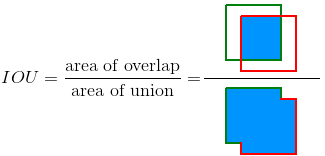

# Testing your model

## For a single instrument class 

1. In `CenterNet_ROOT/src/lib/datasets/dataset` modify `instrument.py` like this `if split == 'test' : ...` : 

    
   

    The function is to specify the label file as the test file test.coco.json created before.

2. Go to `CenterNet_ROOT/src` and run `test.py`

    ~~~
    python test.py --exp_id coco_dla --not_prefetch_test ctdet --load_model path/to/your/model
    ~~~

    For example :

    ~~~
    python test.py --exp_id coco_dla --not_prefetch_test ctdet --load_model /CenterNet_ROOT/exp/ctdet/coco_dla/model_best.pth
    ~~~

    If set up correctly, the output with the above command should look like this :

    
   

    To understand the test results and how they are calculated please refer to [Results](#results)

## For multiple classes 

1. In `CenterNet_ROOT/src/lib/datasets/dataset` modify the `.py` created before (in my case `tools.py`) like this `if split == 'test' : ...` : 

    
   

2. Go to `CenterNet_ROOT/src` and run `test.py`

    ~~~
    python test.py --exp_id coco_dla --not_prefetch_test ctdet --load_model path/to/your/model
    ~~~

    For example :

    ~~~
    python test.py --exp_id coco_dla --not_prefetch_test ctdet --load_model /CenterNet_ROOT/exp/ctdet/coco_dla/model_best.pth
    ~~~

    If set up correctly, the output with the above command should look like this :

    
   

    To understand the test results and how they are calculated please refer to [Results](#results)

## Results 

As you can see after running `test.py`. We obtain a series of average precision `AP` and average recall `AR` values. This is how the results are obtained :

If you want all the details of the calculation, check [Object-Detection-Metrics](https://github.com/rafaelpadilla/Object-Detection-Metrics) it's all explained there. I'll try to summarize the most important points to help understanding how these results are obtained. 

### Intersection over union (IOU)

It measures the overlap between the ground-truth bounding boxes (the hand-labeled bounding boxes) and the predicted bounding boxes by the model. It is the ratio between the Intersection and Union of the ground truth boxes with the predicted bounding boxes.

This images from [Object-Detection-Metrics](https://github.com/rafaelpadilla/Object-Detection-Metrics) illustrates  the `IOU` :

   

Another visual example from our dataset :

   

In green the hand-labelled bounding boxe and in red the predicted one. In practice, we try to get as close as possible to the value 1, but an `IOU>0.50` is already good. 

### Precision and Recall

Precision and Recall are fundamental metrics used to evaluate the performance of classification and detection systems, including object detection in computer vision. Before discussing precision and recall, it's important to understand some key terms:

- True Positive `TP` : The number of times the model correctly predicted the positive input sample. In this context each time an instrument has been detected and located in the image. 

- False Positive `FP` : These are incorrect positive predictions. In this context, a false positive happens when the model incorrectly detects an instrument that is not present in the image.

- True Negative `TN` : These are the correct negative predictions made by a system. Here, a true negative occurs when the system correctly identifies the absence of an instrumenet, i.e., when there is no object in the image, and the model correctly doesn't detect one.

- False Negative `FN` : The number of time the model incorrectly predicted the positive input as negative. In our case false negative occurs when the model fails to detect an instrument that is actually present in the image.

Now, let's discuss precision and recall:

1. Precision measures the accuracy of positive predictions made by a system. It's the ratio of true positive predictions to all positive predictions, showing how accurate the system's positive guesses are. The formula is :

$$ Precision = {TP \over TP + FP} $$

    

2. Recall answers whether your model guessed every time that it should be guessing. The higher the recall, the more positive samples are detected. It is the ratio of true positive predictions to the total number of actual positive cases. Recall is crucial when it's essential to capture all relevant instances. The formula is :

$$ Recall = {TP \over TP + FN} $$

