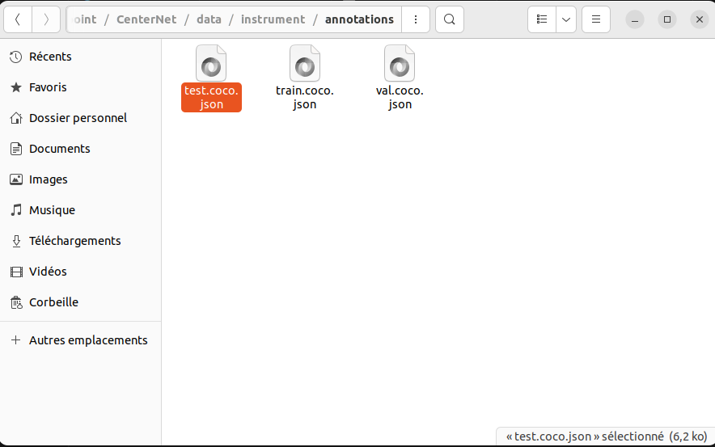
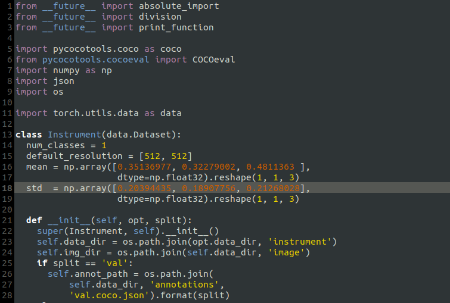
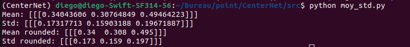

# Training on your own dataset

1. Prepare the dataset

    Data must be in COCO format, you can export directly in COCO format from roboflow or CVAT.
    
     I recommend choosing a 512x512 image format.

     If your dataset includes instruments and you have 1 class that you want to detect, the rest being background, here's how you should proceed. If your dataset contains several classes, please refer to part 2.

     Once you have generated your data in the COCO format go to `CenterNet_ROOT/data/instrument/annotations` and place your 3 coco.
     json files, namely `train`, `val` and `test`. 
     
     
   

     
     Next go to `CenterNet_ROOT/data/instrument/image` and put all your images. 

2. Go to `CenterNet_ROOT/src/lib/datasets/dataset/instrument.py`

    
   

    You can chose the default resolution (300,300) or (512,512). Note that the 512 parameters will increase calculation time and 300 has a small amount of calculation time (I use 512).

    Next, change the mean and std to the mean and variance of your own image data set.

    Run `moy_std.py` in `CenterNet_ROOT/src/` It will calculate the mean and std of `CenterNet_ROOT/data/instrument/image` by default but you can change de repository in the code 

    ~~~
    python moy_std.py
    ~~~

   
