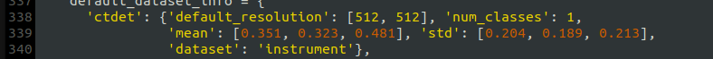
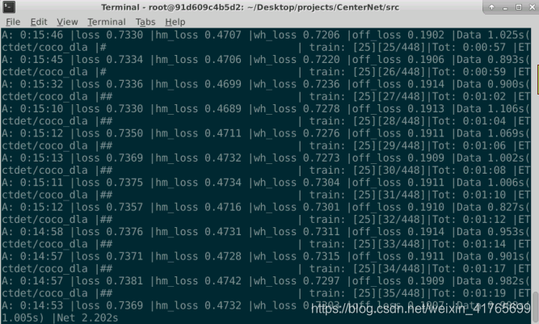

# Training on your own dataset

1. Prepare the dataset

    Data must be in COCO format, you can export directly in COCO format from roboflow or CVAT.
    
     I recommend choosing a 512x512 image format.

     If your dataset includes instruments and you have 1 class that you want to detect, the rest being background, here's how you should proceed. If your dataset contains several classes, please refer to part 2.

     Once you have generated your data in the COCO format go to `CenterNet_ROOT/data/instrument/annotations` and place your 3 coco.
     json files, namely `train`, `val` and `test`. 
     
     
   

     
     Next go to `CenterNet_ROOT/data/instrument/image` and put all your images. 

2. Go to `CenterNet_ROOT/src/lib/datasets/dataset/instrument.py`

    
   

    You can chose the default resolution (300,300) or (512,512). Note that the 512 parameters will increase calculation time and 300 has a small amount of calculation time (I use 512).

    Next, change the mean and std to the mean and variance of your own image data set.

    Run `moy_std.py` in `CenterNet_ROOT/src/` It will calculate the mean and std of `CenterNet_ROOT/data/instrument/image` by default but you can change de repository in the code 

    ~~~
    python moy_std.py
    ~~~

   

3. Go to `CenterNet_ROOT/src/lib/opt.py`

    Modify the default resolution that you chose, the mean and the variance. Put the rounded value obtained previously. 

   

4. Training phase

    In `CenterNet_ROOT/src` run :

    ~~~
    python main.py ctdet --exp_id coco_dla --batch_size 32 --master_batch 1 --lr 1.25e-4

    ~~~
    If there is an error such as insufficient video memory, you need to reduce the batch_size to 16 or 8.

    If you have multiple number of GPU add `--gpus` following your number of gpus with coma. For example if you have 2 GPUS do :

    ~~~
    python main.py ctdet --exp_id coco_dla --batch_size 32 --master_batch 1 --lr 1.25e-4 --gpus 0,1

    ~~~

    If there is no accident, after the above steps, the training will start. 
    Note that the default number of epochs is 140, but you can change this number directly in the `opt.py` file.

    
   

    If you want to start from a pre-trained model and fine-tuned that model with the new images you can. Just add `--load_model /path/to/your/model`
    
    Example :

    ~~~

    python main.py ctdet --exp_id coco_dla --batch_size 32 --master_batch 1 --lr 1.25e-4 --load_model ../models/model_best_final.pth

    ~~~

    