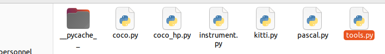
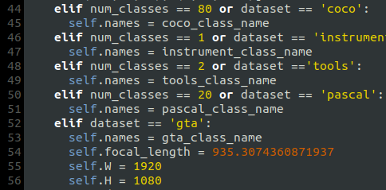

# Training on your own dataset

## For a single instrument class 

If your dataset includes instruments and you have 1 class that you want to detect, the rest being background, here's how you should proceed. If your dataset contains several classes, please refer to [multiple classes part](#for-multiple-classes). 

1. Prepare the dataset

    Data must be in COCO format and annotated with bouding boxes, you can export directly in COCO format from roboflow or CVAT.
    
     I recommend choosing a 512x512 image format.

     

     Once you have generated your data in the COCO format go to `CenterNet_ROOT/data/instrument/annotations` and place your 3 coco.
     json files, namely `train`, `val` and `test`. 
     
     
   

     
     Next go to `CenterNet_ROOT/data/instrument/image` and put all your images. 

2. Go to `CenterNet_ROOT/src/lib/datasets/dataset/instrument.py`

    
   

    You can chose the default resolution (300,300) or (512,512). Note that the 512 parameters will increase calculation time and 300 has a small amount of calculation time (I use 512).

    Next, change the mean and std to the mean and variance of your own image data set.

    Run `moy_std.py` in `CenterNet_ROOT/src/` It will calculate the mean and std of `CenterNet_ROOT/data/instrument/image` by default but you can change de repository in the code 

    ~~~
    python moy_std.py
    ~~~

   

3. Go to `CenterNet_ROOT/src/lib/opt.py`

    Modify the default resolution that you chose, the mean and the variance. Put the rounded value obtained previously. 

   

Now you can process to the [training-phase](#training-phase)

## For multiple classes 

If you want to use CenterNet to detect several different classes of instruments or other objects, here's how to train a model with your own data. Most of the steps are similar to the part for a single instrument class but it is a little longer.

1. Prepare the dataset

    Like for single class, data must be in COCO format and annotated with bouding boxes, you can export directly in COCO format from roboflow or CVAT.
    
     I recommend choosing a 512x512 image format.

     Once you have generated your data in the COCO format go to `CenterNet_ROOT/data` create a new folder. The name is the name of your data set, as shown below in my case I will use the name `tools`

      
   

    Then create two folders in this folder (`annotations` store the three json files we generated before; `images` store all pictures, including training test verification three, all) like in the first part:

     
   

2. Go to `CenterNet_ROOT/src/lib/datasets/dataset/` :

    Copy and paste `coco.py` and rename it with your dataset name, in my case it will be `tools.py`. Open it.
    
   

    0. Change the COCO class to your own name
    1. Change num_classes=80 in line 14 to your own category number (2 in my case)
    2. Chose the default resolution (300,300) or (512,512), note that the 512 parameters will increase calculation time in comparison with the 300.
    3. Next, change the mean and std to the mean and variance of your own image data set. Run `moy_std.py` in `CenterNet_ROOT/src/` It will calculate the mean and std of your data set. Just change the directory in the code to access the images of your dataset:

    
   

    4. Modify the data and image path, data_dir input is the name of the dataset folder we created before, img_dir input is the images image folder

        If you set up correctly your `.py` should look like this :

    
   

    5. Modify the json file path as follows:

    
   

    In my case, `val.coco.json` and `train.coco.json` are the names of my annotation files in COCO format for validation and training annotations. Make sure you fill in the names you put in the annotation folder.

    6. Change the category name and category id to yourself:

        Make sure you put one more ids than your number of classes + background in my case that makes 4. 

    
   

3. Go to `CenterNet_ROOT/src/lib/datasets/dataset_factory` :

     Add your own dataset name in the dataset_facto dictionary (the format is 'the name of the Python file you created before': the name of your own dataset class, because you need to find your data class from the `py` file you created, name must correspond)

      
   

4. Modify `CenterNet_ROOT/src/lib/opts.py`:

    1. The first step is to set your own dataset as the default dataset and add it to the help: 

    
   

    2. Modify the default data set used by the ctdet task to the newly added data set, as follows (modify the resolution, number of categories, mean, variance, data set name):

    
   

    3. Modify the `CenterNet_ROOT/src/lib/utils/debugger.py` into the category and name of your own data, the name of the data set before :

        
   

        Here I add :

        ~~~  
        elif num_classes == 2 or dataset =='tools':
            self.names = tools_class_name
        ~~~

    Plus add the classes of your own data, excluding the background `__background__` :

    
   

    Now you can process to the [training-phase](#training-phase)

## Training-phase

In `CenterNet_ROOT/src` run :

~~~
python main.py ctdet --exp_id coco_dla --batch_size 32 --master_batch 1 --lr 1.25e-4

~~~
If there is an error such as insufficient video memory, you need to reduce the batch_size to 16 or 8.

If you have multiple number of GPU add `--gpus` following your number of gpus with coma. For example if you have 2 GPUS do :

~~~
python main.py ctdet --exp_id coco_dla --batch_size 32 --master_batch 1 --lr 1.25e-4 --gpus 0,1

~~~

If there is no accident, after the above steps, the training will start. 
Note that the default number of epochs is 140, but you can change this number directly in the `opt.py` file.

   

If you want to start from a pre-trained model and fine-tuned that model with the new images you can. Just add `--load_model /path/to/your/model`

Example :

~~~

python main.py ctdet --exp_id coco_dla --batch_size 32 --master_batch 1 --lr 1.25e-4 --load_model ../models/model_best_final.pth

~~~

Once you've finished training, go to `CenterNet_ROOT/exp/ctdet/coco_dla` several models had to be downloaded, you should find :

- The best model calculated with validation data , `model_best.pth` 
- The latest model calculated with the latest epoch, `model_last.pth`
- the model for the epoch 90, `model_90.pth`
- the model for the epoch 120, `model_120.pth`

In the same file you can find a `logs` file, it contains `log.txt` which gives the values of the different losses during training, if you want to plot the result you can.  

    
